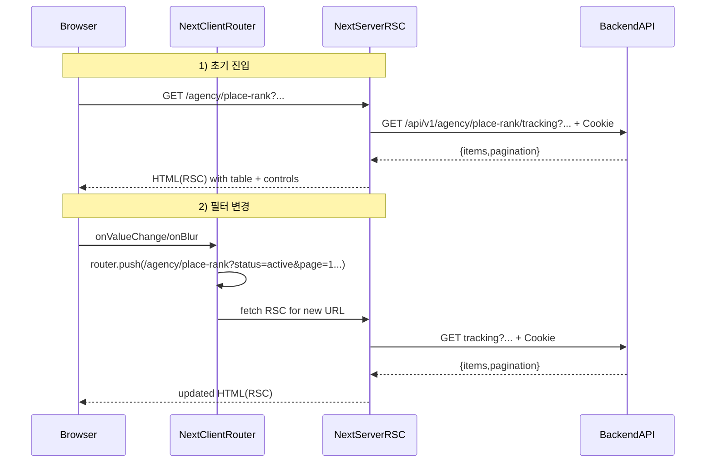

# 플레이스 순위 추적(Tracking) 흐름 정리

이 문서는 현재 구현된 “**필터/셀렉트는 클라이언트**, **데이터 패칭/리스트 렌더링은 서버**” 구조의 **실행 순서(1번/2번/3번)** 를 설명합니다.

## 구성 요소(파일 매핑)

- **페이지(서버)**: `app/agency/place-rank/page.tsx`
  - Next App Router의 `searchParams`를 받아서 하위 컴포넌트에 전달
- **추적 목록 카드(서버)**: `Features/place-rank/ui/PlaceRankTrackingCard.tsx`
  - `searchParams`를 파싱 → 백엔드 호출 → 테이블 렌더링
- **필터/등록 컨트롤(클라이언트)**: `Features/place-rank/ui/PlaceRankTrackingControls.tsx`
  - 필터 변경 시 `router.push`로 querystring 갱신
  - 등록(POST) 성공 시 `router.refresh()`로 서버 렌더 재요청
- **서버 fetch 유틸(서버)**: `Featchs/api/server-fetch.ts`
  - Next 서버에서 `cookies()`를 읽어 백엔드 요청에 Cookie를 전달(401 방지에 중요)

## 사용하는 URL 쿼리 파라미터

서버 목록 조회 API: `GET /api/v1/agency/place-rank/tracking`

프론트 URL에서 사용하는 searchParams(= querystring):

- `status`: `active | stopped` (전체는 생략)
- `keyword`: string
- `advertiser_id`: number(문자열로 들어와도 서버 컴포넌트에서 그대로 전달)
- `page`: number
- `page_size`: number

## 실행 순서

### 1번 실행: 사용자가 `/agency/place-rank` 처음 진입

1. **브라우저가 URL로 페이지 요청**
   - 예: `/agency/place-rank` 또는 `/agency/place-rank?status=active&page=1&page_size=20`
2. **Next 서버가 `app/agency/place-rank/page.tsx`를 실행**
   - Next가 URL querystring을 파싱해서 `searchParams`로 넘김
3. **페이지가 `PlaceRankTrackingCard`에 `searchParams` 전달**
   - `PlaceRankTrackingCard searchParams={searchParams}`
4. **서버 컴포넌트 `PlaceRankTrackingCard` 실행**
   - `searchParams`에서 값을 꺼냄(`status/keyword/advertiser_id/page/page_size`)
   - 없는 값은 기본값(예: page=1, page_size=20)으로 보정
5. **서버에서 백엔드 호출**
   - `serverFetch("/api/v1/agency/place-rank/tracking?…")` 실행
   - `serverFetch` 내부에서 `cookies()`를 읽고, 백엔드 요청에 `Cookie` 헤더로 전달
6. **서버가 테이블 HTML을 렌더링해 내려줌**
   - 첫 화면부터 items가 있는 상태로 렌더링되어 “데이터 없다가 생김” 현상이 줄어듦
7. **클라이언트 컴포넌트 하이드레이션**
   - `PlaceRankTrackingControls`가 브라우저에서 하이드레이션되며 이벤트(onChange/onValueChange 등)가 붙음

### 2번 실행: 필터/셀렉트 값을 변경(상태/키워드/advertiser_id/page_size)

예) 상태를 `active`로 변경

1. **브라우저에서 `PlaceRankTrackingControls` 이벤트 발생**
   - `Select onValueChange` 또는 `Input onBlur/Enter`가 실행
2. **클라이언트가 URL을 갱신**
   - `router.push("/agency/place-rank?status=active&page=1&...")`
   - 필터가 바뀌면 관례적으로 `page=1`로 리셋
3. **Next가 새로운 URL로 라우트 전환**
   - URL이 바뀌었으므로 해당 라우트의 서버 컴포넌트 트리가 다시 렌더 대상이 됨
4. **서버에서 1번 실행의 2~6 과정이 다시 수행**
   - 새 `searchParams` → 새 querystring → 새 백엔드 호출 → 새 HTML 렌더링

즉, 필터 변경은 “클라이언트가 직접 테이블을 fetch해서 바꾸는 방식”이 아니라,
**URL 변경 → 서버 컴포넌트 재실행 → 서버에서 새 데이터를 포함한 HTML 반환** 흐름입니다.

### 3번 실행: 페이지 이동(이전/다음)

1. **사용자가 `이전/다음` 버튼 클릭**
   - 서버 컴포넌트에서 만든 `prevHref/nextHref`가 `<Link href>`로 렌더링됨
2. **URL의 `page`가 변경됨**
   - 예: `page=1` → `page=2`
3. **서버에서 1번 실행의 2~6 과정이 다시 수행**
   - 새 `searchParams.page` 기반으로 백엔드를 재호출하고 목록을 렌더링

## 등록(POST) 시나리오(추적 등록)

등록 API: `POST /api/v1/agency/place-rank/tracking`

1. 사용자가 클라이언트 다이얼로그에서 `keyword/url/advertiser_id` 입력
2. `PlaceRankTrackingControls`가 `http.post(...)`로 등록 요청
3. 성공 시 토스트 출력 + `router.refresh()`
4. `router.refresh()`로 인해 현재 URL(searchParams 기준)로 서버 컴포넌트가 다시 실행되어 목록이 갱신됨

## 시퀀스 다이어그램(요약)

## 메모/주의사항

- **401(인증 실패)**가 나면 대부분 “서버에서 백엔드 호출 시 쿠키가 전달되지 않음”이 원인입니다.  
  현재는 `Featchs/api/server-fetch.ts`에서 `cookies()`를 읽어 `Cookie` 헤더로 전달하고 있습니다.
- 현재 필터 입력은 `onBlur`나 `Enter`에서 URL을 갱신하도록 되어 있어, 입력 중에도 값이 확정되면 즉시 서버 재렌더가 발생할 수 있습니다.  
  (원하면 “검색 버튼을 눌렀을 때만 적용”으로 UX를 바꿀 수 있습니다.)

